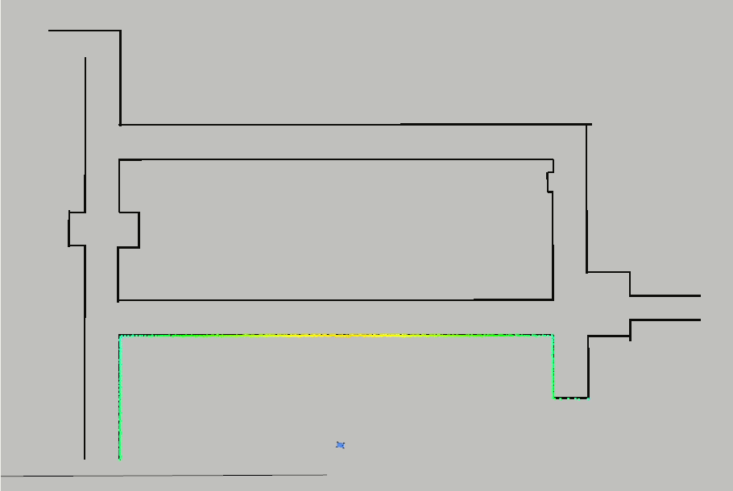

# auto_mapping_ros
Auto Mapping ROS software for autonomously constructing a High Definition Map using Multiple Robots.

This project is still under development and the goal is to develop a ROS service which has the ability to autonomously navigate a blueprint to build a high definition map using SLAM using multiple autonomous robots (F110 Cars).

**How to run this code:**


This repository depends on a planner service. You can use the FMT* Planning Service from my repository here.
```
cd catkin_ws/src
git clone https://github.com/YashTrikannad/fmt_star_ros.git
cd ..
catkin_make

```
Clone and Make this repository
```
cd catkin_ws/src
git clone https://github.com/YashTrikannad/auto_mapping_ros.git
cd ..
catkin_make
```

Running your code. There are a lot of test codes to test specific modules. Example of one module shown below. (Skeletonization, Graph Builder and Coverage Planner do not require ROS so they can be run like a normal C++ file. They are not ROS nodes) 


<p align="center">
</p>


To run the auto mapping module once the sequence is saved, you'll also need to run the FMT* Sevice:

In Terminal 1, launch the simulator:
```
roslaunch racecar_simulator simulator.launch
```
In Terminal 2, launch the service:
```
roslaunch fmt_star fmt_star_service.launch 
```
In Terminal 3, run your global planner test:
```
roslaunch auto_mapping_ros auto_mapping_ros.launch
```
