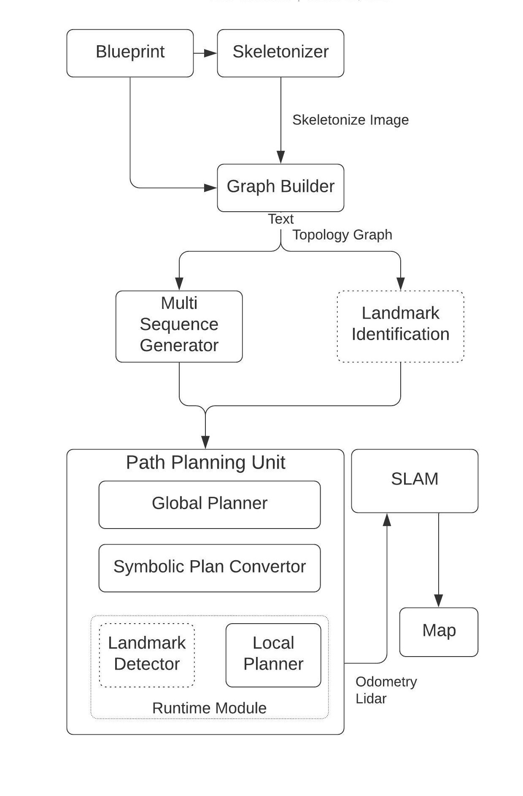

# auto_mapping_ros
Auto Mapping ROS software for autonomously constructing a High Definition Map using Multiple Robots.

This application provides the user with the ability to autonomously navigate a blueprint/floorplans and cover the entire free space to build a high definition map using any 2D/3D SLAM Software using multiple autonomous robots (F110 Cars).

Note: This package only provides control commands for the car to navigate in an indoor space. The user needs to provide localization to enable the car to localize in the blueprint (and thus to continue running the motion planner) and mapping software (optional: This is only required if the user wants to build their map). The simulator will still run without the localization package.

Useful external packages:

Localization: [mit-racecar/particle_filter](https://github.com/mit-racecar/particle_filter)
SLAM: [Google cartographer](https://google-cartographer.readthedocs.io/en/latest/)

<p align="center">
</p>

**Current Capabilities**
- Construct Graph that covers the free space in the user defined area from image of map
- Runs Vehicle Routing for assigning each vehicle the locations that they need to explore
- Autonomously navigates multiple cars on the routes decided for them  
- MPC controller -> Can reverse and find ways to reach goal points even if they are behind  

**Capabilities to be added in future** 
- Have separate threads for each vehicle controller  
- Explore the use of *set of commands (go right, take second left) + wall follower* instead of a the current planning pipeline where reasonable estimate of current pose of robot (localization) is very important. 


**How to run this code:**

Install dependencies
```
sudo apt-get install libconfig++-dev
```

You will need to build the simulator. You can follow the tutorial [here](https://github.com/YashTrikannad/f110-simulator-multi-agent) to build the simulator.

This repository depends on a planner service. You can use the FMT* Planning Service from my repository [here](https://github.com/YashTrikannad/fmt_star_ros).
```
cd catkin_ws/src
git clone https://github.com/YashTrikannad/fmt_star_ros.git
cd ..
catkin_make

```
Clone and Make this repository
```
cd catkin_ws/src
git clone https://github.com/YashTrikannad/auto_mapping_ros.git
cd auto_mapping_ros
git submodule init
git submodule update --remote
cd ../..
catkin_make
```

Source the ROS environment before launching ROS nodes in new terminal
```
cd catkin_ws
source devel/setup.bash
```
**Launching Autonomous Mapper**

The first step is to find the best optimzed routes for the cars to follow. We run ant colony optimization (ACO) in background to get multiple routes for the available cars. Note- All cars may not be used depending on your capacity parameters for ACO. 

To generate the csv files of the route sequences, you'll need to run the multi sequence generator. The multi sequence generator depends on configuration parameters inside the [aco_router](https://github.com/YashTrikannad/aco_router/blob/8964081f2319e5ae4dd99a25f29365ba24645b78/config.cfg). 


1. Launch roscore
```
cd catkin_ws
source devel/setup.bash
roscore
```
2. In new terminal, run the seqeunce creator
```
cd catkin_ws
source devel/setup.bash
rosrun auto_mapping_ros coverage_sequence_creator
```
3. When you see a window popping up with your map titled as *Functional Area Registration*, click on the top left corner and then the bottom right corner which describes the rectangular area where you want the auto mapper to function.

4. After the graph is generated, a window will pop up asking you for the initial depot (starting position for your cars). Click on one of the nodes where you want your cars to start. 

This should generate sequences in [csv folder](https://github.com/YashTrikannad/auto_mapping_ros/tree/master/csv) for ideal number of cars <= vehicles_available parameter set in the config.


<p align="center">
</p>


To run the auto mapping module once the sequence is saved, you'll also need to run the FMT* Sevice:

In Terminal 1, launch the simulator:
```
roslaunch f110_simulator simulator.launch
```

In Terminal 2, run your auto mapping module which will also start the fmt star action server:
```
roslaunch auto_mapping_ros auto_mapping_ros.launch
```
